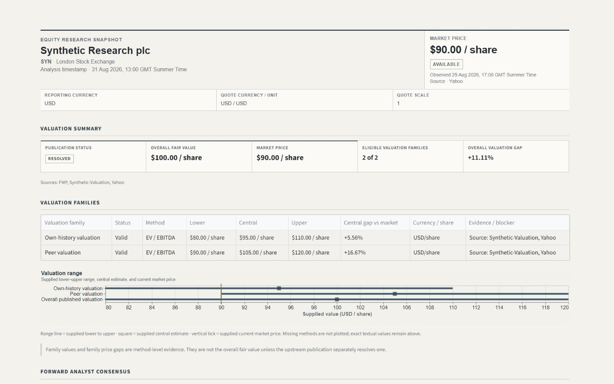
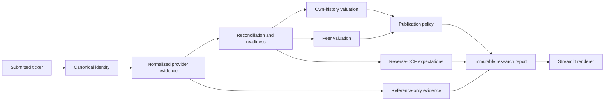
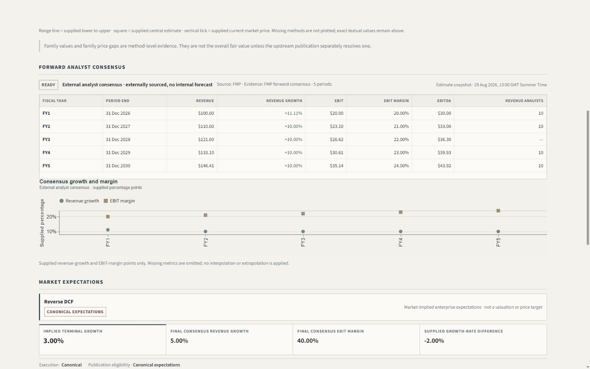
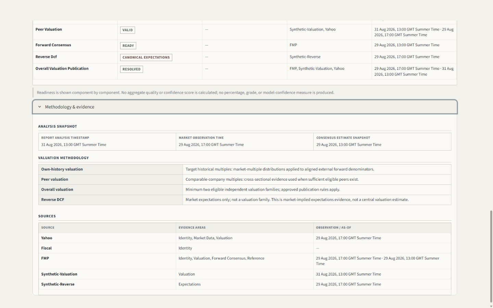

# Stock Analyser

Stock Analyser is a local, evidence-aware equity-research application. It turns a listed-company ticker into a canonical research snapshot that keeps identity, market data, forward consensus, valuation, expectations, provenance, and data-quality states explicit.

**Current build: v1.0.0** · **Interface:** V1 enabled by default · **Validation baseline:** 1,788 provider-free tests before this documentation milestone

The project is designed as decision support, not an automated stock picker. It does not connect to a brokerage, manage a portfolio, or issue BUY / HOLD / SELL recommendations.



## Overview

The released interface presents one immutable research report for one canonical security and analysis timestamp. Upstream services normalize provider evidence, resolve identities, calculate eligible valuation methods, and decide what may be published. The Streamlit layer renders those supplied results without recalculating valuation, price gaps, or reverse-DCF economics.

When evidence is missing, stale, contradictory, unsupported, or inaccessible, the affected section remains partial, unavailable, or withheld. A missing value is never replaced with zero, a convenient provider field, or an alternate listing.

## Key capabilities

- Canonical issuer and security identity with venue-aware listing evidence.
- Normalized current-market-price evidence with explicit currency and quote unit.
- Annual forward revenue, EBIT, and EBITDA consensus where compatible evidence exists.
- Own-history valuation using point-in-time historical multiple distributions.
- Comparable-company EV/EBITDA valuation with identity, security eligibility, economic membership, and method readiness kept separate.
- Central publication policy across eligible valuation families, including explicit resolved, unresolved, wide, and unavailable states.
- Consensus-anchored reverse DCF that reports implied expectations only when its evidence contract is satisfied.
- An isolated, user-supplied scenario mode for WACC, sales-to-capital, and preceding annual revenue; scenario results never replace canonical evidence.
- Currency, quote-unit, period, revision, freshness, and provenance controls throughout the V1 domain.
- Structured evidence and readiness sections rather than a synthetic data-quality score.
- Explicit provider availability outcomes for configuration, authentication, access denial, coverage gaps, rate limits, and failures.

## Research workflow



Identity is resolved before financial evidence is combined. Providers contribute narrowly defined capabilities; one provider's ticker, company name, estimate, or headline valuation is not allowed to become universal truth. The report keeps valuation families, market comparison, reverse-DCF expectations, and reference-only evidence distinct.

See [Architecture](docs/ARCHITECTURE.md), [Methodology](docs/METHODOLOGY.md), and [Data sources](docs/DATA_SOURCES.md) for the production boundaries.

## Valuation framework

V1 publishes two primary valuation families:

| Family | Evidence and method | Failure behavior |
|---|---|---|
| Own history | Historical P/E or EV/EBITDA observations aligned to a compatible forward denominator; eligible observations form a distribution and supplied valuation range | Withheld when identity, period, multiple, denominator, bridge, currency, or sample requirements fail |
| Peers | Independently included comparable issuers with canonical enterprise value and compatible forward EBITDA; peer distribution feeds the target valuation bridge | Withheld below three independent included peers or when target/peer evidence is not method-ready |

The publication layer does not force a midpoint from one available method. It exposes eligible-family count, family ranges, an overall range only when upstream publication policy supplies one, and market gaps only when upstream comparison supplies them.

Publication states are deliberately explicit:

| State | Meaning |
|---|---|
| `RESOLVED` | Upstream evidence supports a central value and publication range |
| `UNRESOLVED` | Available families cannot support one central publication result |
| `WIDE` | Cross-family dispersion exceeds the approved publication threshold |
| `UNAVAILABLE` | No eligible valuation family can publish |

Reverse DCF is an expectations lens, not a third valuation family and not an input to the publication midpoint.

## Market expectations / reverse DCF

The canonical reverse DCF asks what terminal revenue growth is implied by the current enterprise-value anchor after the approved operating trajectory and WACC evidence are fixed. It is fail-closed: missing canonical actual revenue, enterprise-value evidence, forward operating consensus, compatible tax evidence, or production WACC leaves the result unavailable rather than inserting a default.

The scenario workflow accepts exactly three explicit user overrides:

- WACC;
- sales-to-capital ratio; and
- preceding annual revenue for the displayed fiscal period and unit.

Scenario outputs are labeled separately and cannot mutate the canonical report or its publication state.



## Data sources

Provider roles are capability-specific:

| Source | Approved V1 role | Publication treatment |
|---|---|---|
| Fiscal.ai | Canonical Fiscal identity, standardized actuals, historical ratios, enterprise-value/market-cap evidence, peer discovery, and selected research resources when accessible | Central only through the relevant validated method contract |
| Yahoo Finance / yfinance | Traded-security listing metadata, normalized market price/history, return histories for regression beta, and selected market observations | Central where explicitly designated; not an accounting or identity fallback |
| Financial Modeling Prep | Canonical annual forward operating consensus when identity, period, unit, and currency semantics pass; external targets/provider DCF where available | Consensus may be central; targets and provider DCF are reference only |
| Finnhub | Independent validation and capability-specific cash-flow evidence where documented and entitled | Validator; never a silent replacement for canonical FMP consensus |
| Alpha Vantage | Independent revenue/EPS estimate and revision evidence | Validator/reference; no averaging into FMP consensus |
| SEC EDGAR | Independent as-reported US filing and actual-number checks | Verification; not market pricing or a forecast source |
| FRED | USD risk-free-rate evidence through DGS10 | Central WACC input only for compatible USD valuation evidence |
| NYU Stern / Aswath Damodaran | Dated US implied ERP, default-spread tables, and country marginal-tax evidence | Central WACC inputs only when scope, date, and method gates pass |

Access varies by credential, endpoint entitlement, and security. The application reports the actual capability outcome and does not claim unavailable endpoints are working. Detailed policies and known live boundaries are documented in [Data sources](docs/DATA_SOURCES.md) and the [Provider matrix](docs/PROVIDER_MATRIX.md).

## Architecture

The codebase separates concerns into five layers:

```text
provider sources -> adapters -> canonical domain/services -> application coordinators -> Streamlit UI
```

- **Provider sources** perform bounded, read-only transport calls.
- **Adapters** normalize provider-specific shapes into immutable contracts.
- **Domain and services** enforce identity, period, currency, validation, valuation, and publication policies without network access.
- **Application coordinators** build one analysis snapshot, control availability, reuse normalized evidence, and retain safe scenario context.
- **UI renderers** display supplied report fields and controlled blockers without financial recalculation.

Normal pytest is synthetic and network-disabled. Live verification is opt-in and isolated in explicit scripts.

## Screenshots

The screenshots in [docs/assets](docs/assets) use provider-free synthetic evidence rendered by the released V1 UI. They contain no credentials, raw provider payloads, authenticated URLs, or opaque provider identifiers.



Additional views: [scenario analysis](docs/assets/v1-scenario-analysis.png) and [controlled provider-unavailable state](docs/assets/v1-provider-unavailable.png).

## Running locally

### Windows launcher

Double-click:

```text
run_windows.bat
```

The launcher keeps a reusable environment under `%LOCALAPPDATA%\StockAnalyser\venv` and refreshes dependencies when `requirements.txt` changes.

### macOS / Linux launcher

```bash
chmod +x run_mac_linux.sh
./run_mac_linux.sh
```

### Manual startup

```bash
python -m venv .venv
```

Activate the environment, then run:

```bash
pip install -r requirements.txt
streamlit run app.py
```

`streamlit run app.py` is the canonical release command. Startup opens an empty Ticker / Analyse route and makes no provider request until Analyse is selected.

## Configuration

Copy the example file and add only credentials available to the local installation:

```bash
cp .env.example .env
```

On Windows PowerShell:

```powershell
Copy-Item .env.example .env
```

| Variable | Requirement |
|---|---|
| `FISCAL_API_KEY` | Required for live canonical Fiscal identity and Fiscal-backed evidence after submission |
| `FMP_API_KEY` | Optional; enables FMP capabilities where the credential and security are supported |
| `FINNHUB_API_KEY` | Optional validator/capability credential |
| `FRED_API_KEY` | Optional; required for live FRED DGS10 evidence |
| `ALPHAVANTAGE_API_KEY` | Optional validator/revision credential |
| `USE_LEGACY_UI` | Non-secret rollback control; default `false` |

The UI can start without credentials. Missing credentials affect only the corresponding post-submission capability. Never commit `.env`, `.streamlit/secrets.toml`, logs, traces, raw responses, or provider caches.

## Testing

Run the complete provider-free suite from the repository root:

```bash
pytest -q
```

Normal pytest must make zero live network calls. Optional live smoke and audit entry points under `scripts/` are deliberately separate, bounded, and safe-output only; consult [Live smoke testing](docs/LIVE_SMOKE_TESTING.md) before using them.

Coverage includes canonical contracts, provider normalization, reconciliation, identity, unit/currency policies, own-history and peer valuation, WACC evidence, reverse DCF, publication, report assembly, scenario isolation, UI rendering, release routing, and provider-access failures.

## Security and data handling

- Credentials are loaded lazily and are never part of cache keys, provenance records, screenshots, or safe errors.
- Generic transport retains allowlisted error metadata only; raw bodies, headers, authenticated URLs, and secrets do not cross the provider boundary.
- Normalized provider records are not persisted by default.
- The application runs locally; no brokerage or portfolio account is connected.
- Streamlit framework error detail is suppressed in the released configuration.
- Repository ignore rules cover environment files, Streamlit secrets, caches, test dependencies, logs, traces, and browser artifacts.

See [Privacy](docs/PRIVACY.md) and [Terms](docs/TERMS.md).

## Known limitations

- Provider coverage and entitlements vary by security and credential. Fiscal identity access is currently the live canonical entry point, so an access-denied security cannot be rematched through another provider.
- Fiscal peer candidate financial access is uneven; some otherwise canonical peers can remain economically unverified or method-unready.
- FMP forward evidence requires a stable cross-provider identity binding; ticker or company-name equality is insufficient.
- Production WACC is USD-only until an approved currency-specific risk-free source exists for other currencies.
- WACC can be withheld when current gross debt, interest expense, tax, or other method-specific evidence is absent or conflicting.
- The peer method requires at least three independent included issuers.
- Banks, insurers, REITs, pre-revenue firms, and binary clinical/regulatory cases require specialist valuation architecture not supplied here.
- Yahoo/yfinance is appropriate for local research and demonstration, not an institutional market-data feed.
- Valuation output is sensitive to evidence quality, comparability, discount-rate inputs, and provider coverage. This is research software, not investment advice.

## Project structure

```text
stock-analyser/
├── app.py                         # release entry point and retained legacy route
├── src/stock_analyser/
│   ├── domain/                    # immutable canonical contracts
│   ├── providers/                 # provider-specific adapters and sources
│   ├── services/                  # reconciliation, valuation, publication, report assembly
│   ├── application/               # bounded live/report/scenario coordinators
│   └── ui/                        # provider-free V1 rendering and routing
├── scripts/                       # explicit live smoke and safe audit utilities
├── tests/                         # synthetic, network-disabled regression suite
├── docs/                          # architecture, methodology, provider policy, specs, release docs
├── requirements.txt
├── .env.example
├── run_windows.bat
└── run_mac_linux.sh
```

The retained legacy implementation remains in the repository for the v1.0 rollback window; it is not the normal route.

## Release / rollback

Version 1.0.0 starts on V1 by default. To select the retained legacy interface temporarily, set:

```bash
USE_LEGACY_UI=true streamlit run app.py
```

PowerShell:

```powershell
$env:USE_LEGACY_UI = "true"
streamlit run app.py
```

Accepted true values are `1`, `true`, `yes`, and `on`, case-insensitively. Unset, blank, false, or invalid values select V1. The deprecated `ENABLE_V1_REPORT_UI` variable is ignored, and a V1 failure never triggers a silent legacy fallback.

See [v1.0.0 release notes](docs/RELEASE_NOTES_v1.0.0.md).

## Disclaimer

Stock Analyser is provided for educational and research purposes. It does not provide investment advice, a recommendation, or a guarantee of data availability or valuation accuracy. Verify material evidence against primary sources before making an investment decision.
