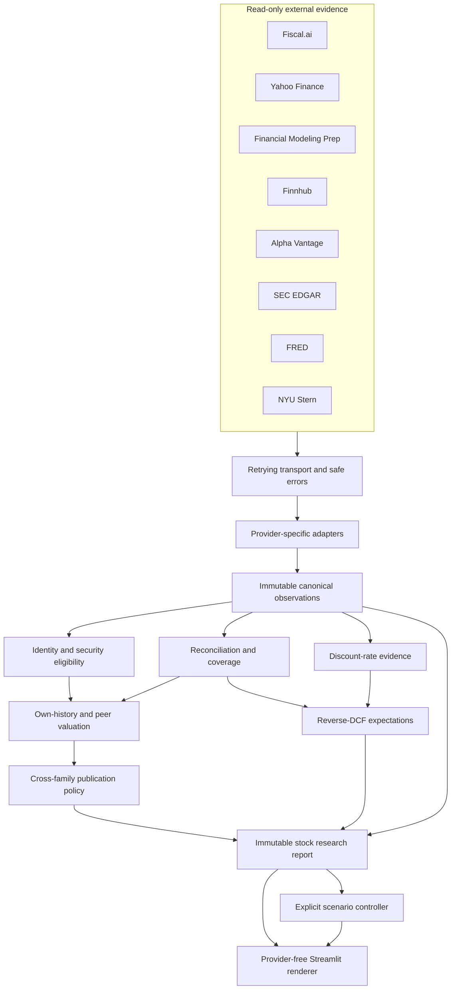
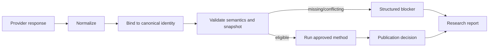

# V1 Architecture

## Purpose

Stock Analyser V1 is a local, provider-independent research-report system. Its architecture is designed to preserve the identity, timing, unit, currency, definition, and provenance of financial evidence before any valuation result reaches the UI.

The central rule is simple: provider access does not imply semantic eligibility. A field can be returned successfully and still be ineligible for a particular method.

## System view

## Layer responsibilities

### Provider sources and transport

Provider sources own endpoint paths, authentication placement, timeouts, and bounded read-only calls. Generic transport classifies only generic transport facts. For example, generic HTTP 403 is not automatically an entitlement failure; a provider adapter may classify entitlement only when documented provider-specific evidence supports it.

Safe failures retain provider, allowlisted endpoint identity, category, optional status, retryability, bounded timing, and a sanitized message. They do not retain raw response bodies, headers, authenticated URLs, or secrets.

### Adapters

Adapters translate provider-specific DTOs into canonical domain observations. They own provider-specific schema aliases, scale conversion, security-type interpretation, and entitlement semantics. They do not reconcile providers, choose a valuation result, or call another provider.

### Canonical domain and services

The domain contains immutable identities, observations, capabilities, provenance, valuation results, and report sections. Pure services enforce:

- stable identity and listing requirements;
- separation of issuer identity, security identity, security eligibility, economic peer selection, and valuation readiness;
- actual/estimate, annual/quarterly, period, case, currency, and unit alignment;
- deterministic revision selection;
- freshness and snapshot cut-offs;
- minimum sample and peer-count policies;
- enterprise-to-equity bridge evidence;
- WACC and reverse-DCF readiness;
- valuation-family and publication eligibility.

Missing or conflicting evidence remains a structured state. Services never use zero as a placeholder and never average validators into canonical evidence.

### Application coordinators

Application coordinators own one requested symbol, one timezone-aware analysis snapshot, provider availability translation, short-lived in-process caching, normalized evidence reuse, and safe stage diagnostics. They orchestrate approved services but do not replace their financial policies.

The scenario controller is separate. It accepts only the three exposed user inputs, runs the approved reverse-DCF scenario service, and returns a scenario result without changing canonical report evidence.

### Streamlit UI

The V1 renderer accepts an immutable `StockResearchReport`. It formats supplied values, renders supplied ranges and market gaps, and displays blockers/readiness. It performs no valuation, price-gap, publication, or reverse-DCF calculation and imports no provider source.

## Evidence flow

Every material result can therefore be traced back to a source observation and policy decision. Reference-only provider targets and provider DCF values stay outside the central publication calculation.

## Valuation families

### Own history

Own-history valuation consumes the target security's canonical historical multiple observations and compatible forward denominators. It calculates a bounded historical distribution, applies the selected multiple to the aligned denominator, and uses enterprise-to-equity bridge evidence where required. Date windows, outlier treatment, denominator semantics, currency, and sample sufficiency are explicit.

### Peers

Peer valuation begins with candidate discovery but does not equate a candidate with an included comparable. Canonical identity, security eligibility, economic comparability, actual financial evidence, and EV/EBITDA data readiness remain separate gates. At least three independent included issuers are required.

### Publication

The publication service consumes eligible family results. It may return resolved, unresolved, wide, or unavailable. Reverse DCF and external provider references are not valuation families. The report layer preserves all family-level states even when no overall value can be published.

## Expectations and scenario isolation

Canonical reverse DCF uses an enterprise market anchor, annual operating trajectory, actual-base evidence, tax evidence, and frozen production WACC. It reports implied expectations only when every method-specific dependency is eligible.

Scenario analysis is opt-in and user-supplied. Scenario inputs are not written into canonical provenance, cached as provider evidence, or promoted into the overall valuation publication.

## Runtime and test boundaries

- `streamlit run app.py` starts V1 by default.
- Startup is idle until Analyse is selected.
- `USE_LEGACY_UI=true` selects the retained legacy route; V1 failures never trigger it automatically.
- Normal pytest is provider-free and blocks network access.
- Live smoke and audit utilities are explicit scripts with safe, allowlisted output.
- Normalized provider responses are not persisted by default.

For detailed contracts, policy identifiers, and milestone decisions, see [VALUATION_V1_SPEC.md](VALUATION_V1_SPEC.md), [PROVIDER_MATRIX.md](PROVIDER_MATRIX.md), [DATA_DICTIONARY.md](DATA_DICTIONARY.md), and [TEST_MATRIX.md](TEST_MATRIX.md).

